# Software-Architektur & Design-Dokumentation

**Version**: v2.1.0  
**Datum**: 2026-02-15

## 1. Systemübersicht

Die Zeiterfassung ist eine reine Client-seitige Web-Anwendung (Single Page Application - SPA), die ohne Backend-Server operiert. Alle Daten werden ausschließlich im lokalen Speicher des Browsers (`localStorage`) des Benutzers gehalten. Dies gewährleistet maximale Privatsphäre und Offline-Funktionalität.

### 1.1 Technologie-Stack

- **Frontend**: HTML5, CSS3, Vanilla JavaScript (ES6+)
- **Speicher**: Browser localStorage
- **Externe Abhängigkeiten**: 
  - jsPDF für PDF-Export (über CDN geladen)
- **Keine Build-Tools erforderlich**: Die Anwendung läuft direkt im Browser

## 2. Architektur-Design

Das System nutzt eine **modulare Architektur**, die auf dem ES6 JavaScript Module Pattern basiert. Dies ermöglicht eine klare Trennung der Zuständigkeiten (Separation of Concerns).

### 2.1 Modul-Abhängigkeitsdiagramm

```mermaid
graph TB
    subgraph Core ["Kernschicht"]
        App["App (Zentraler Controller)"]
        Storage["Storage (Datenhaltung)"]
        I18n["I18n (Unterstützte Texte)"]
        Security["Security (Sicherheit)"]
    end

    subgraph Logic ["Geschäftslogik-Schicht"]
        Holidays["Holidays (Kalenderlogik)"]
        Timesheet["Timesheet (Datenverarbeitung)"]
        Utils["Utils (Hilfsfunktionen)"]
    end

    subgraph UI ["Präsentationsschicht"]
        Calendar["Calendar (UI-Komponente)"]
        Toast["Toast (Benachrichtigungen)"]
        Theme["Theme (Dark Mode)"]
        DOM["index.html / styles.css"]
    end

    subgraph Features ["Feature-Module"]
        Export["Export (HTML-to-Excel)"]
        PdfExport["PdfExport (PDF-Export)"]
        Backup["Backup (Daten-Sicherung)"]
        Search["Search (Suchfunktion)"]
        Report["Report (Berichte)"]
        Version["Version (Versionsverwaltung)"]
        Config["Config (Konfiguration)"]
        Logger["Logger (Logging)"]
    end

    App --> Storage
    App --> I18n
    App --> Security
    App --> Calendar
    App --> Timesheet
    App --> Export
    App --> PdfExport
    App --> Backup
    App --> Search
    App --> Report
    App --> Toast
    App --> Theme
    App --> Version
    App --> Config
    App --> Logger
    
    Calendar --> Holidays
    Calendar --> Storage
    
    Timesheet --> Storage
    Timesheet --> Holidays
    Timesheet --> Utils
    
    Export --> Storage
    PdfExport --> Storage
    PdfExport --> Config
    PdfExport --> Logger
    Backup --> Storage
    Search --> Storage
    Search --> Utils
    Report --> Storage
    Report --> Holidays
    Report --> Utils
    
    Toast --> Security
    Theme --> Storage
    
    Logger --> Config
```



## 3. Modul-Details

### 3.1 `app.js` (Einstiegspunkt)

**Zweck**: Zentraler Controller der Anwendung

**Verantwortlichkeiten**:
- Initialisierung aller Submodule
- Globale Event-Listener-Bindung
- Datenfluss-Steuerung zwischen UI und Speicher
- Home-Office-Limits-Verwaltung (5,5 Tage-Regel)
- Formular-Logik
- Auto-Fill-Funktionalität

**Wichtige Funktionen**:
- `init()`: Initialisiert die gesamte Anwendung
- `onMonthChange(year, month)`: Behandelt Monatswechsel
- `refreshAll()`: Aktualisiert alle Ansichten
- `openEntryForm(dateStr)`: Öffnet das Eingabeformular
- `jumpToToday()`: Springt zum aktuellen Monat

### 3.2 `storage.js` (Datenpersistenz)

**Zweck**: Abstrahiert den Zugriff auf den `localStorage`

**Verantwortlichkeiten**:
- Sichere Datenvalidierung vor dem Speichern
- Datenbereinigung beim Laden
- Fehlerbehandlung bei Datenkorruption

**Wichtige Funktionen**:
- `getAllData()`: Ruft alle Daten ab
- `saveUserInfo(info)`: Speichert Benutzerinformationen
- `saveEntry(dateStr, entry)`: Speichert einen Eintrag
- `getMonthEntries(year, month)`: Ruft Monatseinträge ab

**Datenstruktur**:
```javascript
{
  userInfo: {
    nachname: string,
    vorname: string,
    persNr: string,
    abteilung: string
  },
  entries: {
    "YYYY-MM-DD": {
      type: string,
      beginn?: string,
      ende?: string,
      pause?: number,
      isHalfDay?: boolean,
      dauer?: number,
      aufgezeichnetAm: string
    }
  }
}
```

### 3.3 `security.js` (Sicherheitsmodul)

**Zweck**: Umfassende Sicherheitsfunktionen

**Verantwortlichkeiten**:
- XSS-Schutz durch HTML-Escapierung
- Eingabevalidierung
- Datenbereinigung
- Sichere DOM-Operationen

**Wichtige Funktionen**:
- `escapeHtml(str)`: Escapiert HTML-Zeichen
- `validateEntry(entry)`: Validiert Eintragsdaten
- `sanitizeStorageData(data)`: Bereinigt gespeicherte Daten
- `setTextContent(element, text)`: Sichere Text-Zuweisung

### 3.4 `calendar.js` (Kalender-Komponente)

**Zweck**: Rendering des interaktiven Monatskalenders

**Verantwortlichkeiten**:
- Visualisierung des Monatskalenders
- Status-Anzeige (Arbeitstag, Wochenende, Feiertag, gebuchter Tag)
- Navigation (Vor/Zurück)
- Doppelklick-Handling

**Wichtige Funktionen**:
- `render(year, month)`: Rendert den Kalender
- `onDateDoubleClick(callback)`: Registriert Doppelklick-Callback
- `setMonth(year, month)`: Setzt den angezeigten Monat

### 3.5 `timesheet.js` (Zeitblatt-Verarbeitung)

**Zweck**: Rendert die tabellarische Ansicht der Arbeitszeiten

**Verantwortlichkeiten**:
- Tabellen-Rendering
- Dauer-Berechnung
- Monatliche Summen
- Statistik-Generierung

**Wichtige Funktionen**:
- `render(year, month)`: Rendert das Zeitblatt
- `calculateDauer(beginn, ende, pause, isHalfDay)`: Berechnet Arbeitsdauer
- `formatDauer(hours)`: Formatiert Dauer für Anzeige

### 3.6 `holidays.js` (Feiertags-Logik)

**Zweck**: Berechnet gesetzliche Feiertage (NRW)

**Verantwortlichkeiten**:
- Feiertagsberechnung mit Gaußscher Osterformel
- Wochenend-Erkennung
- Nicht-Arbeitstag-Erkennung

**Wichtige Funktionen**:
- `getEasterDate(year)`: Berechnet Osterdatum
- `isHoliday(date)`: Prüft, ob Datum Feiertag ist
- `isNonWorkingDay(date)`: Prüft, ob Nicht-Arbeitstag

### 3.7 `export.js` (Excel-Export)

**Zweck**: Transformiert Daten in Excel-Format

**Verantwortlichkeiten**:
- HTML-zu-Excel-Konvertierung
- Formatierung beibehalten
- Datei-Download
- Automatisches Backup beim Export

**Wichtige Funktionen**:
- `exportToExcel(year, month)`: Exportiert Monatsdaten als `.xls`-Datei

### 3.8 `pdf.js` (PDF-Export)

**Zweck**: Generiert professionelle PDF-Dokumente im Hochformat

**Verantwortlichkeiten**:
- PDF-Generierung mit jsPDF
- Professionelles Layout (Portrait, A4)
- Automatische Seitennummerierung
- Vollständige Dokumentation aller Daten

**Wichtige Funktionen**:
- `exportToPdf(year, month)`: Exportiert Monatsdaten als `.pdf`-Datei

**Features**:
- Benutzerinformationen
- Vollständige Tabelle mit allen Einträgen
- Summen und Statistiken
- Unterschriftsfelder
- Hinweise zu Abwesenheitskürzeln (links unten)

### 3.9 `backup.js` (Datensicherung)

**Zweck**: Backup und Wiederherstellung von Daten

**Verantwortlichkeiten**:
- JSON-Export aller Daten
- JSON-Import mit Validierung
- Datenmigration
- Automatische Speicherung im `backup`-Verzeichnis

**Wichtige Funktionen**:
- `exportData()`: Exportiert alle Daten als JSON und speichert sie im `backup`-Ordner
- `importData(file)`: Importiert Daten aus JSON-Datei

### 3.10 `search.js` (Suchfunktion)

**Zweck**: Umfassende Suche nach Einträgen

**Verantwortlichkeiten**:
- Suche nach Typ, Datum, Zeitraum, Stichwort
- Ergebnis-Rendering
- Navigation zu gefundenen Einträgen

**Wichtige Funktionen**:
- `search(query)`: Führt Suche durch
- `renderResults(container)`: Rendert Suchergebnisse

### 3.11 `theme.js` (Dark Mode)

**Zweck**: Theme-Verwaltung

**Verantwortlichkeiten**:
- Hell/Dunkel-Modus-Umschaltung
- Systempräferenz-Erkennung
- Theme-Persistenz

**Wichtige Funktionen**:
- `init()`: Initialisiert Theme-System
- `toggle()`: Wechselt zwischen Themes
- `applyTheme(theme)`: Wendet Theme an

### 3.12 `report.js` (Berichtserstellung)

**Zweck**: Generiert statistische Berichte

**Verantwortlichkeiten**:
- Monatsberichte
- Jahresberichte
- Statistik-Berechnung

**Wichtige Funktionen**:
- `generateMonthlyReport(year, month)`: Generiert Monatsbericht
- `generateYearlyReport(year)`: Generiert Jahresbericht

### 3.13 `toast.js` (Benachrichtigungen)

**Zweck**: Toast-Benachrichtigungssystem

**Verantwortlichkeiten**:
- Temporäre Benachrichtigungen
- Verschiedene Typen (Success, Error, Warning, Info)
- Automatisches Ausblenden

**Wichtige Funktionen**:
- `show(message, type, duration)`: Zeigt Toast an
- `success(message)`: Erfolgs-Toast
- `error(message)`: Fehler-Toast

### 3.14 `utils.js` (Hilfsfunktionen)

**Zweck**: Gemeinsame Utilities

**Verantwortlichkeiten**:
- Debounce/Throttle
- Datumsformatierung
- Zeitberechnungen
- Datei-Operationen

**Wichtige Funktionen**:
- `debounce(func, wait)`: Debounce-Funktion
- `throttle(func, limit)`: Throttle-Funktion
- `formatDateDE(date)`: Deutsche Datumsformatierung
- `timeRangesOverlap(...)`: Zeitbereichs-Überschneidung prüfen
- `downloadFile(content, filename, mimeType)`: Erstellt Download-Link für Datei
- `saveFileToDirectory(content, filename, mimeType, directoryName)`: Speichert Datei in spezifischem Verzeichnis (verwendet File System Access API)

### 3.15 `version.js` (Versionsverwaltung)

### 3.16 `config.js` (Konfiguration)

**Zweck**: Zentrale Konfigurationsverwaltung

**Verantwortlichkeiten**:
- Zentrale Speicherung aller Konfigurationswerte
- Sandbox-Isolation (IIFE)
- Defensive Programmierung mit Fallback-Werten

**Wichtige Funktionen**:
- `get(category, defaultValue)`: Ruft Konfigurationswert ab

**Konfigurationskategorien**:
- Home Office Limits
- Standard-Arbeitszeiten
- PDF-Export Einstellungen
- Storage-Konfiguration
- Validierungslimits

### 3.17 `logger.js` (Logging)

**Zweck**: Einheitliches Logging-System

**Verantwortlichkeiten**:
- Zentrale Log-Verwaltung
- Debug-Modus-Kontrolle
- Sandbox-Isolation

**Wichtige Funktionen**:
- `info(message, ...args)`: Info-Log
- `warn(message, ...args)`: Warnung
- `error(message, ...args)`: Fehler
- `debug(message, ...args)`: Debug (nur im Debug-Modus)

**Zweck**: Versionsverwaltung und Update-Hinweise

**Verantwortlichkeiten**:
- Versionsnummer-Verwaltung
- Update-Erkennung
- Willkommensnachrichten

**Wichtige Funktionen**:
- `init()`: Initialisiert Versionsprüfung
- `getCurrentVersion()`: Gibt aktuelle Version zurück

## 4. Datenfluss

### 4.1 Initialisierung

1. `index.html` lädt alle Skripte in der richtigen Reihenfolge
2. `app.js` wird nach DOMContentLoaded ausgeführt
3. `App.init()` initialisiert alle Module:
   - Calendar, Timesheet, Storage
   - Backup, Search, Theme, Version, Report
4. Benutzerinformationen werden geladen
5. Initiales Rendering von Kalender und Zeitblatt

### 4.2 Datenerfassung

1. Benutzer doppelklickt auf Kalendertag
2. `App.openEntryForm()` öffnet Formular
3. Auto-Fill füllt letzte Home-Office-Zeit vor
4. Benutzer gibt Daten ein
5. Validierung erfolgt in Echtzeit
6. Bei Bestätigung: `Storage.saveEntry()` speichert
7. Toast-Benachrichtigung erscheint
8. Alle Ansichten werden aktualisiert

### 4.3 Datenvalidierung

1. Eingaben werden durch `Security`-Modul validiert
2. Datumsformat wird geprüft
3. Zeitbereiche werden validiert
4. Zeitkonflikte werden erkannt
5. Bei Fehlern: Toast-Fehlermeldung
6. Bei Erfolg: Speicherung und Bestätigung

## 5. Design-Prinzipien

### 5.1 KISS (Keep It Simple, Stupid)
- Minimale Abhängigkeiten
- Kein Build-Prozess nötig
- Direkte Browser-Ausführung

### 5.2 Privacy by Design
- Keine Daten verlassen den Browser
- Lokale Speicherung nur
- Keine Tracking-Mechanismen

### 5.3 Defensive Programmierung
- Umfassende Eingabevalidierung
- Fehlerbehandlung auf allen Ebenen
- Sichere DOM-Operationen
- Datenbereinigung beim Laden

### 5.4 Modularität
- Klare Trennung der Verantwortlichkeiten
- Wiederverwendbare Module
- Einfache Erweiterbarkeit

### 5.5 Performance
- Debounce/Throttle für Eingaben
- Caching für Feiertagsberechnungen
- Virtual Scrolling für große Tabellen
- Minimale DOM-Manipulationen

## 6. Sicherheit

### 6.1 XSS-Schutz
- Alle Benutzereingaben werden escapiert
- Sichere DOM-Operationen über Security-Modul
- Keine `innerHTML` mit Benutzerdaten

### 6.2 Eingabevalidierung
- Whitelist-basierte Typ-Validierung
- Bereichsprüfungen für numerische Werte
- Datums- und Zeitformat-Validierung

### 6.3 Datenintegrität
- Validierung vor dem Speichern
- Bereinigung beim Laden
- Fehlerbehandlung bei Korruption

### 6.4 Content Security Policy
- CSP-Header in HTML
- Beschränkung externer Ressourcen
- Schutz vor Code-Injection

## 7. Erweiterbarkeit

### 7.1 Neue Eintragstypen
1. Typ zu `Security.ALLOWED_ENTRY_TYPES` hinzufügen
2. Übersetzung in `i18n.js` hinzufügen
3. CSS-Styles hinzufügen
4. Logik in `timesheet.js` anpassen

### 7.2 Neue Features
1. Neues Modul in `js/` erstellen
2. In `index.html` einbinden
3. In `App.init()` initialisieren
4. UI-Elemente hinzufügen

### 7.3 Andere Bundesländer
1. `holidays.js` erweitern
2. Bundesland-spezifische Feiertage hinzufügen
3. UI-Auswahl hinzufügen (optional)

## 8. Performance-Optimierungen

### 8.1 Debounce/Throttle
- Eingabefelder: 500ms Debounce
- Scroll-Events: Throttle
- Resize-Events: Throttle

### 8.2 Caching
- Feiertagsberechnungen pro Jahr
- Letzte Home-Office-Zeit
- Theme-Präferenz

### 8.3 Virtual Scrolling
- Für große Zeitblätter (>100 Zeilen)
- Nur sichtbare Zeilen rendern
- Scroll-Position verwalten

## 9. Browser-Kompatibilität

### 9.1 Unterstützte Browser
- Chrome 90+
- Firefox 88+
- Edge 90+
- Safari 14+

### 9.2 Erforderliche Features
- ES6+ JavaScript
- localStorage
- CSS Grid
- CSS Custom Properties (Variables)

## 10. Wartung

### 10.1 Code-Qualität
- JSDoc-Kommentare für alle Funktionen
- Konsistente Namenskonventionen
- Modulare Struktur

### 10.2 Dokumentation
- README.md für Benutzer
- ARCHITEKTUR.md für Entwickler
- CHANGELOG.md für Versionshistorie
- Inline-Kommentare im Code

### 10.3 Testing
- Manuelle Tests empfohlen
- Browser-Kompatibilitätstests
- Datenmigrations-Tests

---

**Letzte Aktualisierung**: 2026-02-15  
**Version**: 2.1.0

## 11. PDF-Export-Modul Details

### 11.1 Layout und Formatierung

Das PDF-Export-Modul (`pdf.js`) generiert professionelle PDF-Dokumente im Hochformat (Portrait, A4).

**Struktur:**
1. **Titel**: Anwendungstitel
2. **Benutzerinformationen**: Nachname, Vorname, Personalnummer, Abteilung
3. **Monat und Jahr**: Aktueller Monat und Kalenderjahr
4. **Tabelle**: Alle Tage des Monats mit:
   - Datum
   - Wochentag
   - Beginn
   - Pause
   - Ende
   - Dauer
   - Abwesenheitsgrund
5. **Zusammenfassung**: Summe der Arbeitsstunden
6. **Unterschriftsfelder**: Datum und Unterschrift Mitarbeiter
7. **Hinweise**: Erklärung der Abwesenheitskürzel (links unten)

### 11.2 Spalten

Die PDF-Tabelle enthält folgende Spalten:
- **Datum**: Format DD.MM.YYYY
- **Wochentag**: Montag bis Sonntag
- **Beginn**: Startzeit (HH:MM)
- **Pause**: Pausenzeit in Minuten
- **Ende**: Endzeit (HH:MM)
- **Dauer**: Berechnete Arbeitsdauer (Format: X,X Std)
- **Abwesenheitsgrund**: Typ der Abwesenheit (Home-Office, Urlaub, etc.)

**Hinweis**: Die Spalte "aufgezeichnet am" wurde in Version 2.1.0 entfernt.

### 11.3 Farbcodierung

- **Home-Office**: Grün
- **Urlaub**: Gelb
- **Krank/Kind krank**: Rot
- **Gleitzeit**: Blau
- **Feiertage/Wochenenden**: Grau

### 11.4 Seitennummerierung

Bei langen Monaten (>31 Tage) wird automatisch eine neue Seite erstellt, wenn der Platz nicht ausreicht.

### 11.5 Hinweise

Die Hinweise zu Abwesenheitskürzeln werden links unten auf der letzten Seite positioniert:
- K - Krank
- TU - Urlaub
- F - Feiertag
- GLZ - Gleitzeit
- AZK - Arbeitszeitkonto
